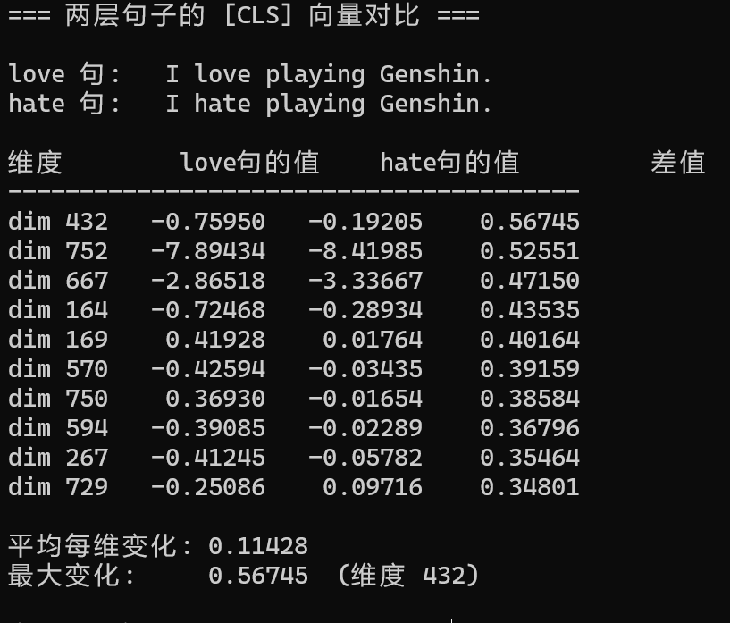

# 一、环境搭建

## 1.Anaconda

Anaconda 提供高效的包管理器 conda，用于安装和管理 Pytorch 和相关依赖库

安装 pytorch:深度学习框架，训练神经网络

## 2.anaconda prompt 中创建虚拟环境

`conda create -n 环境名 python=3.13.12`

`pip install transformers torch`

# 二、模型搭建

## 1.总览：DPPR 架构（Dialogue-based Personality Prediction）

```
输入："I love trying new things"
       ↓ tokenizer分词器
[CLS], I, love, trying, new, things
       ↓
+----------------------------------+
|  BERT (12层Transformer)          |
|  每个token变成768维向量           |
+----------------------------------+
       ↓ 取[CLS]向量
FC1: 768 → 256  (ReLU + Dropout)
FC2: 256 → 128  (ReLU + Dropout)
FC3: 128 → 5    (线性输出)
       ↓
输出: [O=3.8, C=2.1, E=4.2, A=3.5, N=1.8]
```

## 2.BERT 模型：通过 BERT 模型，可以将任意一句话变成一个 768 维的 CLS 向量

URL:<https://huggingface.co/google-bert/bert-base-uncased/tree/main>

下载 config.json 、 pytorch_model.bin 、 vocab.txt 、 tokenizer_config.json

在 conda prompt 中 run code

`python bert.py`


`python bert1.py`



加入中立句


发现维度 432：中立句的值介于 love 和 hate 之间，但不是 love 和 hate 的平均值，说明情感维度不是某个单一维度的线性表示

\[CLS]  Classification Token 代表整句话的向量，包含整句话的含义

## 3.768 维 CLS 向量经过三层全连接层，输出五维人格向量

python dppr_fc.py

```
nn.Linear(768,256)
FC1:y1 = ReLU(W × CLS + b)
ReLU函数引入非线性变换
       ┌──────────┐   ┌─────┐   ┌──────┐
       │    W     │ × │CLS  │ + │ b    │
       │ 256×768  │   │768×1│   │256×1 │
       └──────────┘   └─────┘   └──────┘
相当于把CLS的768维加权求和，得到256维的向量y1

FC2:y2 = ReLU(W × y1 + b)

       ┌──────────┐   ┌─────┐   ┌──────┐
       │    W     │ × │y1   │ + │ b    │
       │ 128×256  │   │256×1│   │128×1 │
       └──────────┘   └─────┘   └──────┘

FC3:y3 = ReLU(W × y2 + b)

       ┌──────────┐   ┌─────┐   ┌──────┐
       │    W     │ × │y2   │ + │ b    │
       │ 5×128    │   │128×1│   │5×1│  │
       └──────────┘   └─────┘   └──────┘


```


怎么保证输出的五维人格向量是正确的？
也即：怎么知道变换矩阵 W 是对的？

## 4.训练过程

```
每一轮训练：
1.前向传播，得到输出的五维人格向量y3
2.计算损失函数MSE（均方误差），表示预测值与真实值的差异
3.反向传播（梯度下降），更新W和b
```

`pip install convokit`

出现：Successfully built convokit

接着进入交互模式：python

`from convokit import Corpus, download`

创建实例`corpus = Corpus(filename=download("persuasionforgood-corpus"))`

出现：Dataset already exists at 路径，证明数据集下载成功

`corpus.print_summary_stats()`


可以看到：

Speakers 1285 人 参与对话的用户总数（说服者 + 被说服者）

Utterances 20932 句 所有对话里拆出来的句子总数

Conversations 1017 段 完整的说服对话段数

看被说服者的五维人格

```
speaker = list(corpus.iter_speakers())[0]
print(speaker.id)
print(speaker.meta)
```


### 训练模型

加载数据

提取 ee 并标记：有 ocean 值的是被说服者

遍历收集 ee 说的话并拼接成一个字符串

字符串送入 BERT 模型，得到 768 维的 CLS 向量，将 CLS 向量转为 5 维向量 ocean

多轮训练

```
python dppr_train.py
```


由图中结果可知，均方损失为12.4405，偏大

**推测可能原因：缺少原论文的transformer encoder层，没有把ee的句子分开，而是合并成一段字符串，造成结果严重偏差**

第二次训练加入transformer encoder


可以看到测试误差下降到0.7左右，但是出现了过拟合现象

**t推测原因**：模型参数为8M，模型容量大，数据集仅1017条对话，数据少，出现过拟合

**解决**：尝试early stopping 和 k-fold
